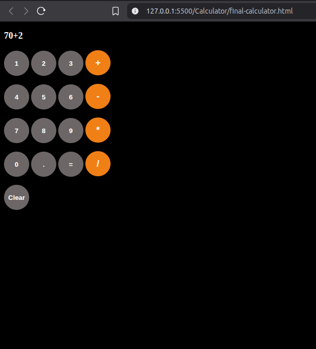

# Calculator   

A simple calculator project built with **HTML, CSS, and JavaScript**. It supports basic arithmetic operations like addition, subtraction, multiplication, and division.  

---

##  Features  
- Basic arithmetic operations (+, −, ×, ÷)  
- Responsive design  
- Interactive UI with button click effects  
- Clear button

---

##  Technologies Used  
- **HTML5**  
- **CSS3**  
- **JavaScript (ES6+)**  

---

##  Preview



---

## 📂 How to Run  

1. Clone this repository or download the folder:  
   ```bash
   git clone https://github.com/levelupsoftwares/JS-Projects.git

2.  After cloning, you can go into this project-folder like this:
  ```bash
     cd JS-Projects/Calculator

---