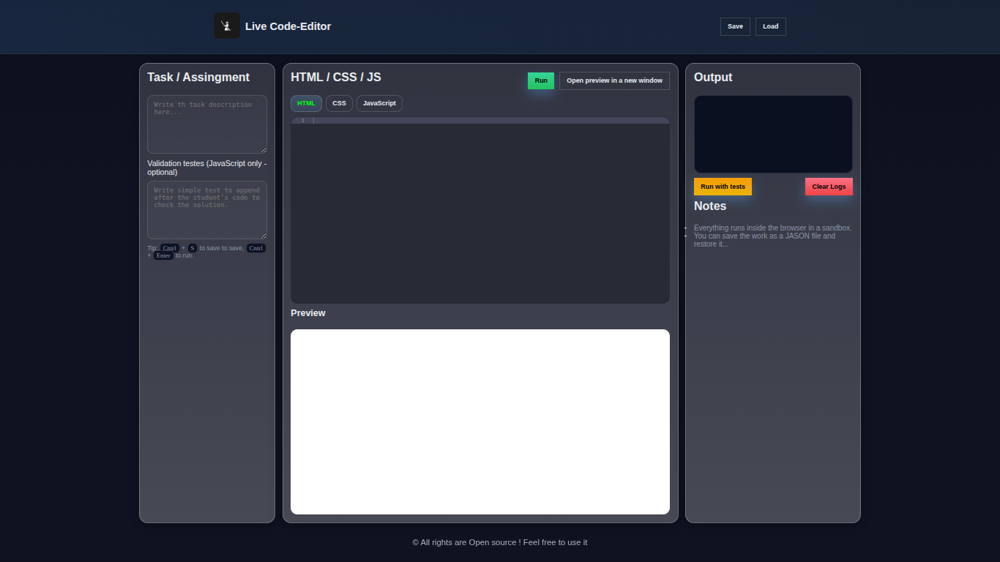

# Web-Based Code Editor 💻  

A lightweight and responsive **Web Code Editor** built using **Ace Editor** and **JavaScript**.  
This project allows users to write, edit, and preview code directly in the browser — just like a mini version of VS Code!

---

##  Features  

- Syntax highlighting for multiple programming languages  
- Real-time editing and rendering    
- Auto-indentation and line numbering  
- Supports HTML, CSS, and JavaScript code execution  
- Clean and responsive UI  

---

##  Technologies Used  

- **HTML5**  
- **CSS3**  
- **JavaScript (ES6+)**  
- **Ace Editor (CDN)**  

---

##  Preview



---

##  How to Run  

1. Clone this repository or download the folder:  
   ```bash
   git clone https://github.com/levelupsoftwares/JS-Projects.git
2. cd JS-Projects/CodeEditor
